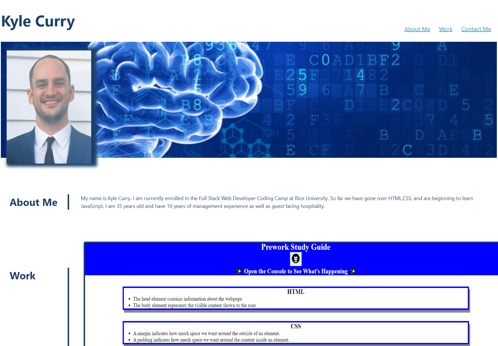

# C2-Portfolio-Kyle-Curry

## Description

This Challenge's purpose is to build the structure for a portfolio that I will continue to build and add to as I continue on in the Web Development Coding Camp. In this we were given gif of an example webpage and I feel I have captured it's esscence and made it my own. I learned how to manipulate flex box to get the results I want in several areas as well as the confidence to code from scratch.

## Screenshot

## Link to deployed application

https://hotbarbeque.github.io/C2-Portfolio-Kyle-Curry/